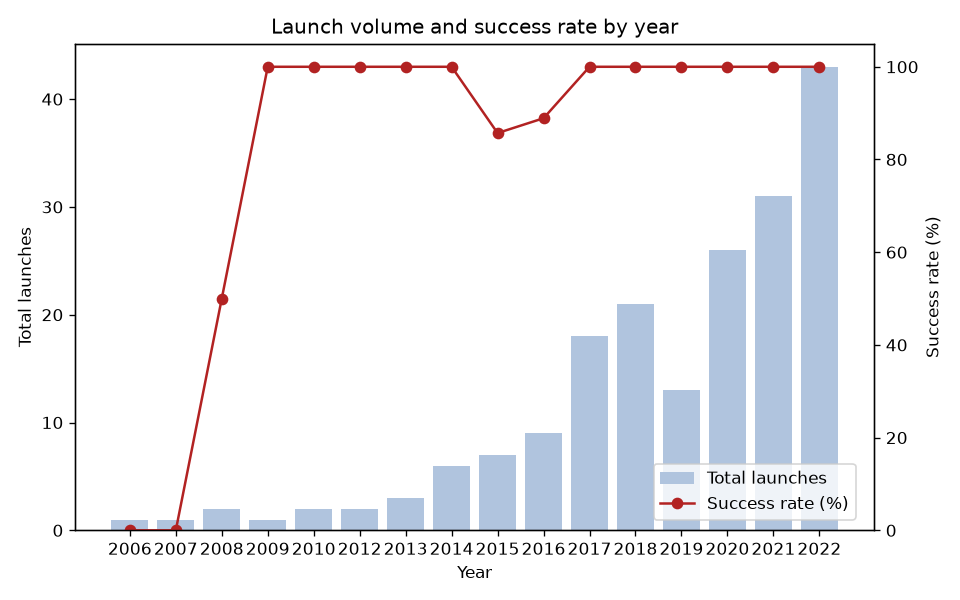
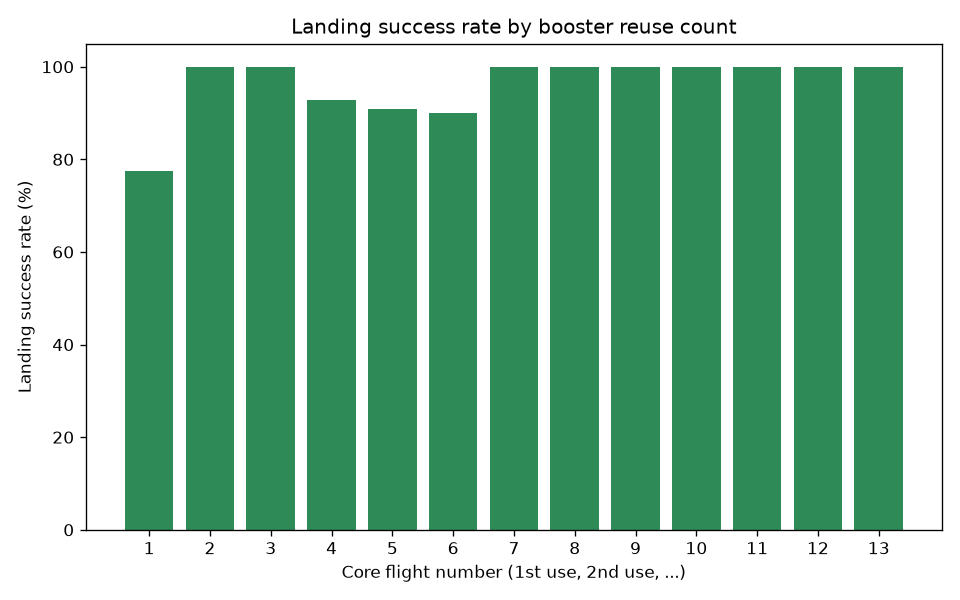
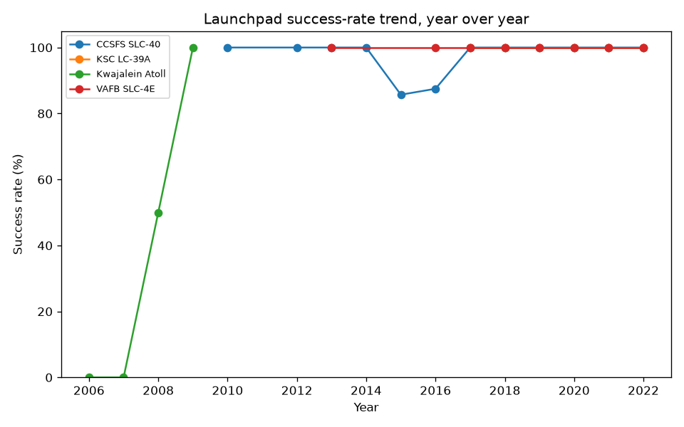
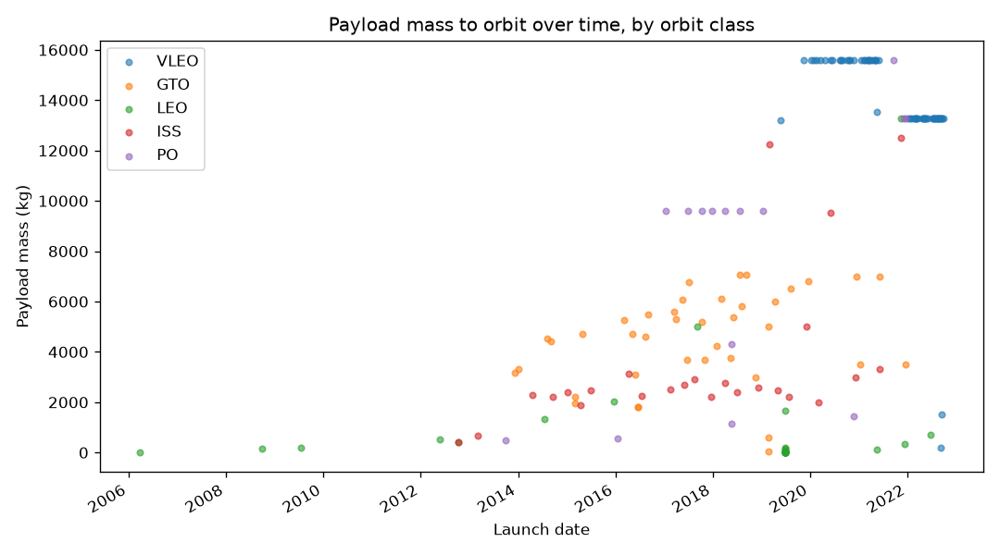
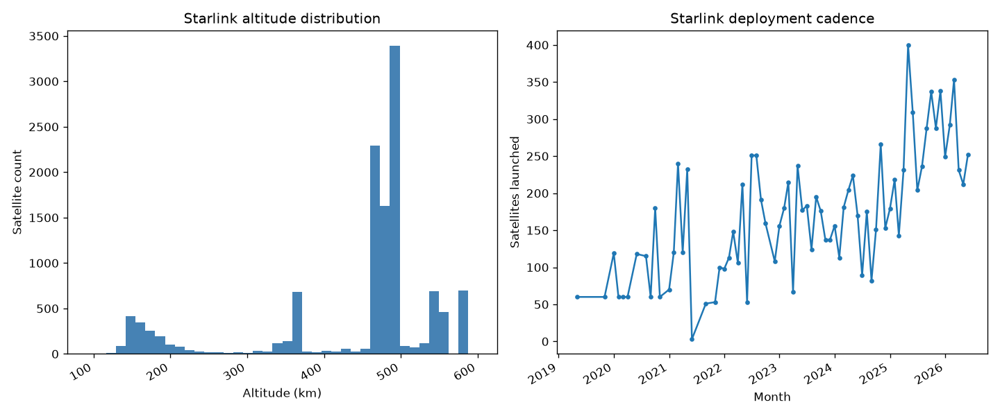
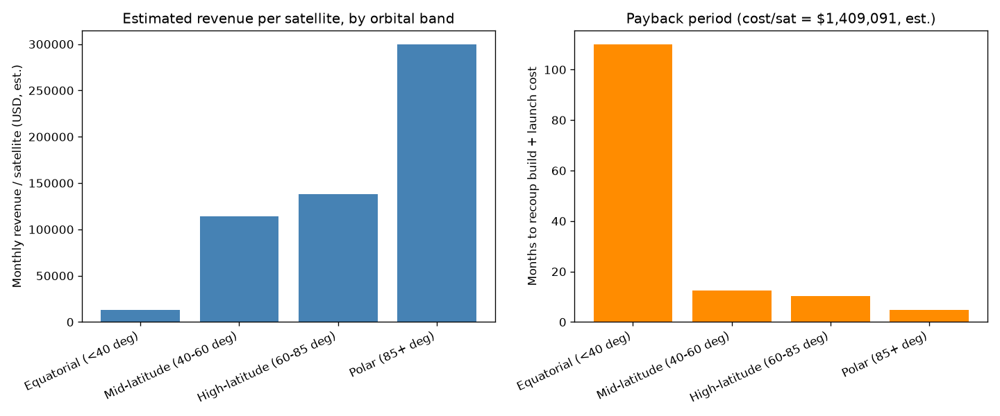

# SpaceX Launches -> SQLite

Ingests the public [SpaceX API v4](https://github.com/r-spacex/SpaceX-API)
(rockets, launchpads, landpads, capsules, cores, launches, payloads, and
Starlink satellites) into a normalized SQLite database, and answers a handful
of analytical questions with SQL and pandas.

## Dataset choice

**Source:** [SpaceX API v4](https://github.com/r-spacex/SpaceX-API) (docs:
`docs/` in that repo) — naturally relational (launches reference rockets,
launchpads, cores, capsules, payloads), long history (2006–present) for trend
analysis, well-documented fields.

**The live API died mid-build** (source repo archived, hosted API now returns
Cloudflare 525 on every endpoint). Each table now has its own real fallback
(Wayback snapshot, hand-seeded, derived, or — for `starlink` — a live
Celestrak feed that also covers the >=10MB raw-size requirement). Full story,
per-table sourcing, and tradeoffs: see "Known data quality" below.

## Repo layout

```
sql/schema.sql        Normalized DDL + indexes
sql/er_diagram.md      Mermaid ER diagram (renders on GitHub or mermaid.live)
scripts/ingest.py       Download + transform + idempotent load into SQLite
analysis/analysis.py    SQL + pandas/matplotlib questions, run against the DB
tests/test_ingest.py    Offline tests: idempotency, FK joins, malformed-record handling
.github/workflows/tests.yml   CI: schema validation, ruff, mypy, pytest on every push/PR
pyproject.toml          pytest/ruff/mypy configuration
requirements.txt
requirements-dev.txt    Adds pytest, ruff, mypy -- for local dev/checks
LICENSE                 MIT
```

The SQLite database file itself (`spacex.db`) and any charts are **not**
committed — they're generated by running the scripts below.

## Setup

```bash
python3 -m venv .venv && source .venv/bin/activate
pip install -r requirements.txt
```

## Run the ETL

```bash
python scripts/ingest.py --db spacex.db
```

This creates `spacex.db`, applies `sql/schema.sql`, then loads all 9 tables
and logs (to stdout and to `ingest.log`) the total raw bytes downloaded and
the row count loaded per table. **The source per table is no longer uniformly
"the live SpaceX API"** (see "Known data quality" below for why and the full
per-table breakdown) — at a glance:

| Table | Source |
|---|---|
| rockets, capsules, launches, payloads | Wayback Machine snapshot of the real API response |
| launchpads, landpads | hand-seeded (no live/cached source exists) |
| cores | derived id-only stubs from `launches` (no live/cached source exists) |
| starlink | **live** — Celestrak GP elements + SATCAT |
| starlink_pricing_bands | hand-curated unit-economics assumptions (see "Starlink unit economics" below) |

Only `starlink` still involves a live network fetch of fresh data on every
run; the rest replay a frozen snapshot since the original source is gone.

For a cheap first check that credentials/network/schema all work before
committing to the full pull, use `--limit N` to only load the first N records
per endpoint (note: this still downloads the full response, it just truncates
what gets written to SQLite):

```bash
python scripts/ingest.py --db /tmp/smoke.db --limit 5
```

**Malformed records don't abort a run** — each is parsed individually, logged,
and skipped (see `safe_map()`/`validate_response()` in `ingest.py` for the
full shape/size checks).

**Idempotency:** every top-level table is keyed by the API's natural id and
loaded via `INSERT ... ON CONFLICT DO UPDATE`. Child collections that don't
have a natural single-column key (a launch's failures/cores/capsules, a
payload's customers/nationalities) are deleted and reinserted per parent
inside the same transaction as that parent's upsert. Re-running the script
against an existing `spacex.db` will not create duplicate rows — verify with:

```bash
python scripts/ingest.py --db spacex.db   # run twice
sqlite3 spacex.db "SELECT COUNT(*) FROM launches;"   # count unchanged
```

## View the schema

Open `sql/er_diagram.md` on GitHub (renders Mermaid natively) or paste its
contents into https://mermaid.live.

See the header comment in `sql/schema.sql` for design notes (CHECK
constraints on boolean columns, `last_ingested_at` audit columns, and why
`ships`/`crew` are out of scope).

## Run the analysis

```bash
python analysis/analysis.py --db spacex.db --out analysis/output
```

Prints every question's result (with the raw SQL shown for Q1-Q3, Q6) to
stdout, and saves a PNG chart per question (six total) to `analysis/output/`.

### Questions answered

1. **(SQL)** Has SpaceX's launch success rate improved year over year?
2. **(SQL)** Does landing success rate hold up as a booster core is reused
   more times (1st flight vs. 10th flight, etc.), or does it degrade?
3. **(SQL — CTE + JOIN + window function)** Which launchpads are trending
   better or worse year over year, and by how much? Joins `launches` to
   `launchpads` and uses `LAG()` to compute each pad's change against its own
   prior year, isolating a per-pad signal that Q1's fleet-wide number hides.
4. **(pandas + matplotlib)** How has payload mass to each orbit class (LEO,
   GTO, SSO, ...) evolved over time?
5. **(pandas + matplotlib)** What does the Starlink constellation's altitude
   distribution look like, and how fast is it being launched (satellites per
   month)?
6. **(SQL + pandas)** Which orbital bands generate the best revenue per
   satellite relative to the fixed cost of building and launching one? A
   back-of-envelope unit-economics model — see "Starlink unit economics"
   below for the full assumptions and sourcing.

Rationale for each is inline as a docstring above the corresponding function
in `analysis/analysis.py`.

### Sample charts (real run, 2026-07-06)

Static snapshots committed to `docs/images/` for display here — the pipeline
itself never commits generated charts (see `analysis/output/` in
`.gitignore`); re-run `analysis/analysis.py` per above to regenerate fresh
ones from your own database.

**Q1 — launch volume and success rate by year:**



**Q2 — landing success rate by booster reuse count:**



**Q3 — launchpad success-rate trend, year over year:**



**Q4 — payload mass to orbit over time:**



**Q5 — Starlink altitude distribution & launch cadence:**



**Q6 — Starlink unit economics by orbital band:**



## Tests

```bash
pip install -r requirements-dev.txt
pytest -v
```

Runs entirely offline against synthetic fixtures (`tests/fixtures.py`) shaped
like real API responses, so it doesn't depend on `api.spacexdata.com` being
reachable. Covers: every table gets populated on first load, a second
identical load doesn't change row counts, an upstream field change updates
the existing row instead of duplicating it, a removed child item (e.g. a
launch failure that no longer appears upstream) doesn't survive a re-ingest,
one malformed record doesn't take down the rest of the batch, and FK joins
resolve.

Lint and type checks:

```bash
ruff check .
mypy
```

CI (`.github/workflows/tests.yml`) runs all of the above on every push/PR,
plus an independent check that `sql/schema.sql` builds cleanly on its own
(not just indirectly via the Python test suite).

## Sample output (real run, 2026-07-06)

Row counts: 4 rockets, 4 launchpads, 7 landpads, 25 capsules, 78 core stubs,
205 launches, 225 payloads, 12,340 starlink satellites (~10,700 active,
~1,630 decayed), 4 starlink_pricing_bands — **11.9MB raw downloaded**,
clearing the >=10MB target.

```
=== Q1: Launch success rate by year ===
year  total_launches  successful  success_rate_pct
2018              21          21             100.0
2019              13          13             100.0
2020              26          26             100.0
2021              31          31             100.0
2022              43          43             100.0
```

Full Q1–Q5 output (including Q3's per-pad trend table and Q5's altitude
stats) is reproduced by running `analysis/analysis.py` per above.

Two things worth noting from this run: the Q3 pad names join correctly
against the hand-seeded launchpads, confirming the id → site mapping is
right, and the Wayback-sourced `launches`/`payloads` data turns out to be
frozen around **October 2022** (latest resolved launch: Crew-5) — the
community dataset behind the archived API had apparently stopped updating
before the API itself went dark, so Q1/Q3 reflect history only through 2022.

## Known data quality / API notes

### The live SpaceX API is dead

Discovered mid-build (2026-07-05): `api.spacexdata.com` and its documented
backup `backups.spacexdata.com` both return Cloudflare **525** (SSL handshake
to the origin failed) on every endpoint. The `r-spacex/SpaceX-API` source
repo was archived (read-only) on 2026-06-06 — the maintainer has stopped
running the backend entirely; this isn't a rate limit or a transient blip.
There is no static data dump anywhere in that repo either (checked the full
file tree — it's server source code and docs, not a data export).

Per the exercise brief's own tip ("if you hit an API rate limit or odd data
quality issue, note it in the README") — rather than switch datasets
entirely, each table now has its own real fallback, chosen for the least
compromise relative to what was already built:

| Table | Real source used | Why |
|---|---|---|
| `rockets`, `capsules`, `launches`, `payloads` | Wayback Machine snapshot of the actual API response (Feb 2026 / Aug 2024) | Same JSON shape as the live API — zero code changes to the transform/load logic. |
| `launchpads`, `landpads` | Hand-seeded, 4 + 7 rows | No Wayback snapshot exists for either endpoint (checked; only Cloudflare error pages or nothing at all was ever crawled). SpaceX has only ever used this fixed, tiny set of physical sites, so a short static list is the practical alternative to an unavailable source. The id -> site mapping isn't a guess: it's cross-validated against the real Wayback `launches` snapshot's own launch history (e.g. the id whose earliest referencing launch is FalconSat/2006 has to be Kwajalein — that's the only site Falcon 1 ever flew from; the id whose earliest reference is CRS-10/Feb-2017 has to be KSC LC-39A — the well-documented first flight there after the Sep-2016 pad explosion took SLC-40 offline). Two of the eleven ids (VAFB SLC-4E, LZ-2) are additionally confirmed verbatim via the archived repo's own doc examples. |
| `cores` | Derived id-only stubs | No live or archived source has core metadata (serial, block, reuse/landing counts) at all. Every core id referenced by a real ingested launch gets a stub row (`core_id` only, every other column null) purely so the `launch_cores` foreign key resolves. This is a genuine, documented gap, not fabricated data. |
| `starlink` | **Live** — [Celestrak](https://celestrak.org) GP elements (`GROUP=starlink`) + public [SATCAT](https://celestrak.org/pub/satcat.csv) | The only table that needed a real live replacement, not just a cached fallback, because it's what makes the >=10MB raw target achievable (see below). Celestrak provides current orbital elements for active satellites and launch/decay history for all (active + decayed) via SATCAT; `scripts/ingest.py` merges the two on `OBJECT_ID` (COSPAR id) and derives `semimajor_axis_km`/`height_km`/`period_min` from `MEAN_MOTION` via Kepler's third law. **Not available from this source** (documented as null, not silently dropped): `launch_id` (Celestrak has no concept of SpaceX's internal launch ids), and `longitude`/`latitude`/`velocity_kms` (would require SGP4 propagation of the TLE to a specific instant, not just the static elements Celestrak publishes) — analysis Q5 doesn't depend on any of these three. |

### Meeting the >=10MB raw requirement, post-outage

Wayback-sourced tables total well under 1MB combined. The real size now comes
from `starlink`'s live sources: the SATCAT CSV alone is ~6.6MB (all
satellites ever cataloged; filtered client-side to ~12,000 Starlink rows),
and the GP JSON for ~10,700 currently-active Starlink satellites adds
several more MB (~400 bytes/record) — comfortably clearing 10MB combined with
everything else. `ingest.py` logs the real total on every run.

### Celestrak's anti-spam throttle

`celestrak.org/NORAD/elements/gp.php` enforces a courtesy, presumably per-IP,
throttle: repeat requests for a `GROUP` within its ~2-hour refresh window get
a `403` with a body like *"GP data has not updated since your last successful
download... Data is updated once every 2 hours."* This is not a real outage —
`scripts/ingest.py` surfaces a clear message pointing at this if it's the
cause of a failed run. The SATCAT CSV has no such throttle.

- Some `launches` fields (`static_fire_date_utc`, `details`, `landing_success`)
  are legitimately `NULL` for upcoming or partially-documented missions —
  queries use `NULLIF`/`WHERE ... IS NOT NULL` rather than assuming non-null.
- `payloads.mass_kg` and `orbit_params.*` are occasionally null for classified
  (e.g. some national-security) payloads; those rows are excluded from Q4
  rather than coerced to 0.
- `scripts/ingest.py` retries each network fetch up to 3x with backoff before
  raising a clear error.

## Starlink unit economics (Q6)

Q6 (`analysis/analysis.py`) estimates revenue per satellite vs. the fixed
cost of building and launching one, broken out by **orbital band** — bands
defined by inclination (the max latitude a satellite's ground track reaches),
not by country, since that's directly computable from the ingested
`starlink.inclination_deg` column with no ground-coverage model needed.
**No API publishes Starlink subscription pricing or per-satellite
economics** — every number below is a documented, cited, back-of-envelope
estimate, not measured data or verified financials.

| Band | Inclination | Real shell(s) | Monthly price (blended) | Throughput |
|---|---|---|---|---|
| Equatorial | 0–40° | ~33° (v1.5-class) | $32 — blended low-inclination-market residential price (Nigeria, Kenya, Brazil, Rwanda) | 20 Gbps |
| Mid-latitude | 40–60° | 53°/53.2° (v2 Mini-class, bulk of the constellation) | $95 — blended core-market residential price (US, UK, EU) | 60 Gbps |
| High-latitude | 60–85° | 70° | $115 — assumed ~1.2x mid-latitude for remote markets (northern Canada, Scandinavia, Patagonia); not directly sourced | 60 Gbps |
| Polar | 85–100° | 97.6° | $250 — approximates the Mobility/Maritime/Priority tier this shell mostly serves; a rough placeholder, not a published rate card | 60 Gbps |

Static seed data (`PRICING_BANDS_SEED` in `scripts/ingest.py`), loaded into
`starlink_pricing_bands` the same way `LAUNCHPADS_SEED`/`LANDPADS_SEED` are.

**Capacity model:** customers/satellite = throughput ÷ 50 Mbps assumed
average concurrent per-user bandwidth (`AVG_USER_MBPS` in
`analysis/analysis.py`) — a simplifying constant; real per-user throughput
varies a lot with time of day and congestion.

**Cost model:** $500,000 build cost + ($20,000,000 marginal reused-booster
Falcon 9 launch cost ÷ 22 satellites/launch) ≈ **$1.41M/satellite**
(`BUILD_COST_USD_PER_SAT`/`LAUNCH_COST_USD`/`SATS_PER_LAUNCH` in
`analysis/analysis.py`), applied uniformly across bands.

**Sources:**
- Build cost: [Starlink is Now the SpaceX Cash Machine — NextBigFuture](https://www.nextbigfuture.com/2025/08/starlink-is-now-the-spacex-cash-machine.html)
- Launch cost & satellites/launch: [Starlink — Unit Economics — SpaceXChart](https://spacexchart.com/starlink), [Falcon 9 — Orbital Radar](https://orbitalradar.com/launch-vehicles/falcon-9)
- Regional pricing: [Starlink Prices by Country](https://www.starlink-prices.com/), [How affordable is Starlink? — Intermedia](https://iicintermedia.org/vol-53-issue-2/how-affordable-is-starlink/)
- Throughput: [Modeling Starlink capacity — Mike Puchol](https://mikepuchol.com/modeling-starlink-capacity-843b2387f501), [Starlink Orbital Capacity — NextBigFuture](https://www.nextbigfuture.com/2023/12/spacex-starlink-orbital-capacity-and-usable-capacity.html)

**A real finding from running this against live data:** the Equatorial
band currently has **zero active satellites** (all ~10,700 active satellites
in the live Celestrak pull fall in the mid-latitude/high-latitude/polar
bands) — so its revenue/payback numbers are presently hypothetical, not a
reflection of an operating shell. This is exactly the kind of thing a
back-of-envelope model surfaces rather than hides: SpaceX doesn't appear to
be currently operating a shell below 40° inclination.

## Known limitations

- **Cross-snapshot foreign keys get nulled, not crashed, when they don't
  resolve.** rockets/launchpads/landpads/capsules/launches/payloads come from
  independently-dated sources (see table above), so a launch's `rocket_id`/
  `launchpad_id`, a core's `landpad_id`, or a payload's `launch_id` can
  reference a parent row absent from its (differently-dated) table. Rather
  than let `PRAGMA foreign_keys = ON` abort the whole insert, these get
  nulled with a logged warning. Running with `--limit N` produces the exact
  same symptom for an unrelated reason (truncation, not a real mismatch) --
  the warning message says which one it is.
- **A run that fails partway leaves some tables fresher than others.** Each
  table commits independently (a deliberate tradeoff so e.g. Celestrak's
  throttle doesn't force re-fetching Wayback snapshots that already
  succeeded) -- the single-row `ingest_runs` table only gets written after
  every table succeeds, so comparing it against each table's
  `last_ingested_at` reveals whether the database reflects one full run or
  a mix of runs.
- **`cores` has no metadata beyond its id** (see table above) — `serial`,
  `block`, and reuse/landing counts are null for every row. Q2's analysis
  (landing success by reuse count) uses `launch_cores.core_flight_num`, which
  *is* available (it comes from `launches`, not `cores`), so this gap doesn't
  block any of the 5 analysis questions -- it would only matter for a
  hypothetical future question keyed on core identity/specs.
- **`starlink.launch_id` is always null**, and `longitude`/`latitude`/
  `velocity_kms` are always null too (see table above). The `idx_starlink_launch`
  index is consequently unused until/unless a real join key is reconstructed.
- **`launchpads`/`landpads` row counts and some launch/landing-attempt
  tallies are approximate or null**, not live-API-fresh, since they're
  hand-seeded rather than fetched (see table above).
- **No deletion/sync semantics for top-level entities.** `ingest.py` only
  ever upserts rockets/launchpads/landpads/capsules/cores/launches/payloads/
  starlink rows -- if a record ever disappeared from its source entirely (as
  opposed to just changing fields), the corresponding local row would
  persist indefinitely rather than being removed. This is a deliberate scope
  decision, not an oversight: SpaceX's launch history is effectively
  append-only (a rocket doesn't get un-built, a launch that happened doesn't
  get un-launched), so full snapshot-sync-with-deletion would add real
  complexity (cascading deletes across every child/junction table) for a
  scenario that doesn't realistically occur in this dataset. Child
  collections (a launch's failures/cores/capsules, a payload's
  customers/nationalities) *do* get this treatment, via delete-then-reinsert
  per parent, because those genuinely do change shape between runs.

## Tech choices

- SQLite (stdlib `sqlite3`) — no server to stand up, single portable file,
  sufficient for this data volume.
- `requests` for HTTP, `pandas`/`matplotlib` for the two Python-tooling
  questions — no heavier framework needed for a dataset this size.

## Optional: Docker

```bash
docker build -t spacex-launches .
docker run --rm -v "$(pwd)/data:/data" spacex-launches
```

Runs the ETL then the analysis inside the container; `spacex.db`, `ingest.log`,
and the charts land in `./data` on the host (the container's `/data` is a
volume so nothing generated lives inside the image, consistent with the repo
itself not committing them). Not exercised in CI — Docker wasn't available
in the environment this was built in, so treat it as reviewed-but-unverified
rather than tested.
