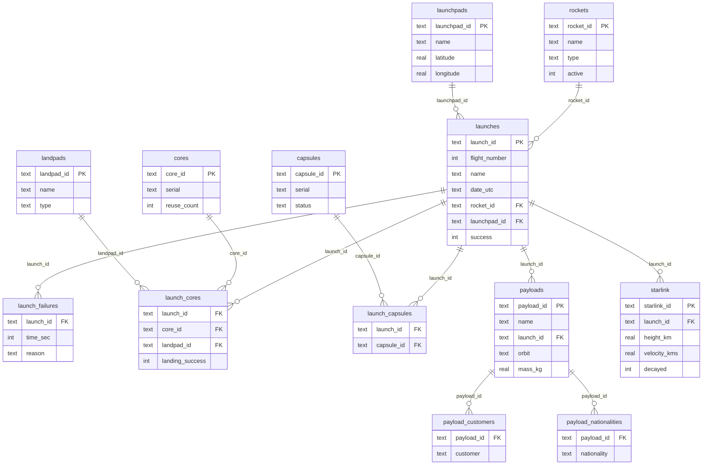

# ER Diagram



Rendered version: paste this file's contents into the [Mermaid Live Editor](https://mermaid.live) or view directly on GitHub, which renders ` ```mermaid ` code blocks natively in Markdown.
